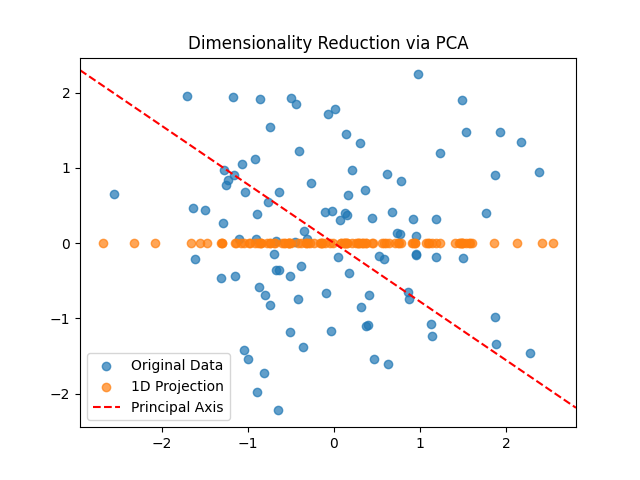

# AMS595 - Assignment5: Machine Learning Project

This repository contains a Python implementation of various machine learning tasks as part of the AMS595 course. The project covers PageRank, Principal Component Analysis (PCA), Linear Regression, and Gradient Descent optimization. Results are saved and organized in a results folder for easy visualization.


## Table of Contents

- Introduction
- Project Structure
- Tasks Implemented
- How to Run
- Results
- Dependencies
- License
## Introduction

This project demonstrates practical implementations of the following concepts:

- PageRank Algorithm: Simulates the ranking mechanism used by search engines.
- Dimensionality Reduction via PCA: Projects high-dimensional data to a single dimension while preserving maximum variance.
- Linear Regression via Least Squares: Predicts house prices based on features using least-squares regression.
- Gradient Descent: Optimizes a matrix to minimize a mean squared error loss function.
All results are stored in the `results` folder for reproducibility and easy access.
## Project Structure

```
├── machine_learning_with_results.py  # Main Python script
├── results                           # Output folder
│   ├── pagerank_results.txt          # PageRank scores and ranking
│   ├── pca_plot.png                  # PCA plot
│   ├── linear_regression_results.txt # Regression coefficients and predictions
│   ├── gradient_descent_results.txt  # Final loss value after optimization
├── README.md                         # Project documentation (this file)
```

## Run Locally

Clone the project

```bash
  git clone https://github.com/amol1202/AMS595_Assignment5.git
  cd AMS595_Assignment5
```

Install dependencies

```bash
  pip install -r requirements.txt
```

Run the script

```bash
  python machine_learning_with_results.py
```


## Results

**PageRank scores and rankings**
*PageRank Scores:* [0.15789473684210537, 0.21052631578947376, 0.31578947368421045, 0.31578947368421045]
*Highest ranked page:* 3


***Regression coefficients and predicted price**
Regression Coefficients:* [3.287500000000088, -1628.7500000000448, -77.75000000000227]
*Predicted Price for new house:* 1448.750000000031


**Final loss value**
*Final Loss Value:* 0.0

**Visualization of PCA results**


